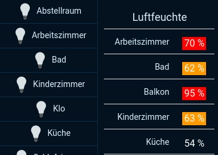

# MultiState
Multistate widget to control a group of switches, rollershutters, and other items.

The original widget is implemented by [Michael](https://community.openhab.org/u/martmiwp/summary) in this [thread]( https://community.openhab.org/t/custom-widget-multi-state-widget/35913/1).

Current version is 1.3.

Changes:

V1.3
Switch shows now the state of the dimmable lights and other items that have a numeric value with a thin bar at the bottom of each item. If the switch is just on/off, no bar is shown.

V1.2
Switch item names can be configured non-visible based on their value.

V1.1
* Items are ordered by their label.
* The widget can be configured to align the buttons on top, handy to make several widgets of different sizes look neater.
* The switch items are now shown without the iOS style indicator, instead the state is indicated with background colour change. This saves space on small displays. The code for the old mode is still in the HTML file.
* Turning on and off all switches now follows the same layout as an individual switch.
* Dimmers with value 100 are now counted also as 'on' for the count on top of the widget.
* The rollershutter items have a bit different display that is easier to read and click. It takes a bit more space horizontally.
* Windows have state colours (red = open, yellow = tilted, no background when closed) and different icons when opened or closed.
* Show summary of states and all on/off are now off by default.
* German words have been removed or changed to English.
* A new configuration setting to remove extra words from the items. For example, if the item labels end with "Light" for Amazon Alexa, it can be removed to make the widget more pleasant to the eye. The word can be be in any location of the label.
* Some extra checks to set the item to a good state when it has not been initialised by OpenHAB yet. This is the case, for example, for KNX devices that are not been activated after OpenHAB has been restarted.
* Buttons do not get hovering borders after clicking anymore.
* If OpenHAB does not know the position of a rollershutter, it gives NULL value. This is no longer shown in the UI.
* Can display a list of Humidity Values and color the background if the Values are below or above Low and High value (configurable)

Preview Images:

 
